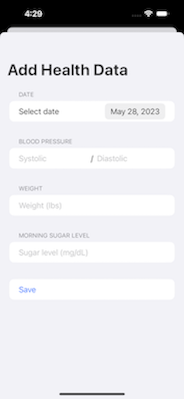
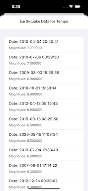

[Github Page](github.com/Markay12/SwiftProgramming-Introduction)

# Swift Language

Swift is an intuitive programming language created by Apple for iOS, macOS, watchOS, and tvOS app development. It's an open-source language that is designed to be not only easy to learn, but also powerful enough for professional developers. Since its introduction in 2014, Swift has quickly become one of the fastest growing languages in history.

Swift adopts safe programming patterns and adds modern features to make programming easier, more flexible, and more fun. The compiler is optimized for performance, and the language is optimized for development, without compromising on either.

Swift incorporates the latest research on programming languages, combined with decades of experience building Apple platforms. Named parameters are expressed in a clean syntax that makes APIs in Swift even more easy to read and maintain. Memory is managed automatically and there is no use of semicolons.

In addition, Swift supports inferred types to make code cleaner and less prone to mistakes, and modules eliminate headers and provide namespaces.

# GitHub Swift Structure

The structure of this GitHub page is setup with three main sections. The three main sections are as follows

1. docs
2. Projects 
3. Exploratory

## Docs

The docs directory stores all the documented information on how to write code using swift. The docs in here include quick notes on how to use Swift and its modules. This section is more for learning about Swift and how to use the language than actual projects. Syntax, namespace, and optimization techniques are included. The learning modules included up to May 26th 2023 are

1. Introduction [For Syntax]
2. Arrays
3. Dictionaries
4. Navigation View

All four of these are great to get started learning how to use the Swift language and start creating your own applications.

## Projects

The projects directory includes many projects that I have worked on and projects that you can start with yourself. They are all great starting places for anyone to get their hands on Swift. The list that I will be putting here is how I suggest starting with the projects. This is so you can begin with some easier subjects before moving onto the more difficult app programming techniques.

### Person Information Application

This is a good introductory application to learning how to use Swift and Storyboards. This application is a simple input and output based app that logs user information and based on that information, returns output.

This app takes users SSN, Name, and Age. This information is then stored using CoreData on the phone. Since the information is stored, users and patients that have already been logged into the system can be searched. Example of the front UI is shown here.

### Patient Portal

The patient portal application was developed to showcase the use of multiple different modules working together. The file structure of this project showcases how to modularize the code. There is a new file for each working sheet/part of this project. 

Rather than having a button on the main view that executes a large group of code, it will call the methods and functions of the other file in the project. Therefore, this project demonstrated encapsulation and inheritance between different files and objects. 

In addition to what was added above, this project exhibits a better UI design for users. As the projects continue the UI and UX will become increasingly better as we are no longer just focused on the basics of code but also usability.

The above three images showcase the main workings of the application. The user is able to add information about their health each morning and it will be added to their log. 

As the user inputs information it will be checked to see whether or not they are in a healthy range for their body. This is where the check is made and will alert the user if their health readings are not good.

### JSON Data Access

This project serves as a tutorial to learn how to use JSON data within an iOS application. 

JSON (JavaScript Object Notation) data files are a common format for storing and exchanging structured data. JSON files are human-readable and consist of key-value pairs, arrays, and nested structures. Here's a breakdown of the key aspects:

1. Structure: JSON files follow a simple structure, often resembling JavaScript object syntax. Data is organized into key-value pairs, where the key is a string and the value can be various data types, such as strings, numbers, booleans, arrays, or nested objects.

2. Data representation: JSON provides a way to represent complex data structures in a concise and standardized format. It is widely used for transmitting and storing data, especially in web development and API interactions.

3. Interoperability: JSON is a language-independent format, meaning it can be easily parsed and generated by different programming languages. This allows for seamless data interchange between different systems and platforms.

4. Readability and editing: JSON files are human-readable, making them easy to understand and modify. Developers can open and edit JSON files using any text editor or specialized JSON editors.

5. Popular use cases: JSON files are commonly used for configuration files, web API responses, data storage, and exchanging data between client-server applications. They are often utilized in combination with JavaScript and web technologies.

This application specifically uses earthquake data that has been captured. The earthquake data is taken from geonames.org. The user is asked to provide a location, then it will respond with all earthquake data from that location that geonames has. 

This application integrates the use of API calls to get JSON data. It is also able to parse through JSON information and show users earthquake data. Longitude and latitude data is extracted from the location the user provides, then geonames uses those numbers to gather information.

The user interface and experience has also been enhanced from previous apps to give a better feel to the application and make it more usable.

### Core Data Introduction

This core data introduction accomplishes the same thing as the JSON data introduction. Core data is something that is used for iOS applications and is different than JSON. 

Core Data is a framework provided by Apple for managing the storage and retrieval of data in iOS app development. It serves as an object graph and persistence framework, allowing developers to work with structured data efficiently.

1. Data Model: Core Data uses a data model to define the entities (objects) and their relationships within your app. The model is represented using an .xcdatamodeld file, where you define entities, attributes, relationships, and other metadata.

2. Object Graph: Core Data creates an object graph that represents the data model. It allows you to work with entities and their relationships as objects in memory. You can create, modify, and relate objects within the graph, making it easier to manage complex data structures.

3. Persistence: Core Data provides built-in persistence, which means it can save the object graph to a persistent store (like a SQLite database or XML file) and retrieve it later. It handles tasks such as fetching, inserting, updating, and deleting data objects transparently, providing an abstraction layer over the underlying storage mechanism.

4. Faulting: Core Data uses faulting to optimize memory usage. It only loads data into memory when it is actually accessed, and placeholders called faults are used until then. Faulting allows Core Data to efficiently manage large data sets and minimize memory footprint.

5. Managed Object Context: Core Data utilizes a managed object context to handle interactions with the object graph. The context tracks changes to objects and manages the lifecycle of these objects, including saving changes to the persistent store.

6. Relationships and Fetching: Core Data allows defining relationships between entities, enabling navigation between related objects. It also provides powerful querying capabilities with a rich set of APIs for fetching specific objects or executing complex queries using predicates and sort descriptors.

This application is broken into six main files. The one that focuses on CoreData is Persistence.swift. This is an automatically generated file from XCode that is used when using Core Data. The purpose for the file is to manage the stack data trace of the application for data access. 

Below is what each individual file accomplishes and how it relates to the app as a whole.

**Content View**

- All the necessary and main components of the application are within this file. The content navigation, view and modules are in this file. These files incorporate all the other modules within the body of the application. 
- Functions are also within this file to add cities and remove cities. Though there are other modules used to show these views, functions needed to be made to accomplish these ideas. For instance, one can remove a city by swiping left on their phone. This is a commonly recognizable gesture used on most mobile devices. 

**Image Picker View**

- The purpose of this view is to show the user a list of their images to choose from to use for their city. This core data application takes in a list of cities and then the user can add images to showcase the city. The image picker gets access to the users images (with permission) and then allows the user to choose an image they want to use for that city. 
- Code is used to track what images the user uses for each city. Tracking of the image that the user selects is important for core data so that the image will not go away when the user reloads the application.

**Add City View**
- This view is used within the main content view sheet when the user requests to add a new city. The image picker is also located within this sheet and the add city button. The add city function is the second most important sheet to this core data application other than the main sheet which stores all information. 

**City Detail View**
   
- This view is the main sheet for the application and is what shows information of the added cities by the user. This is the main information that encapsulates all the previous files and information for the whole functioning application. 

## Conclusion

As for now, these are the only included projects in this repostitory. Some projects had to be left out so that they would not interfere with copyright and protection at Arizona State University.

As always, reach out with any questions that you may have.

[Github Page](github.com/Markay12/SwiftProgramming-Introduction)
